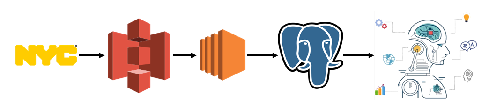
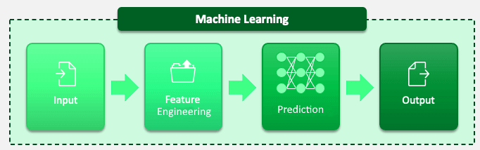

# NYC Taxi Fare Prediction

The problem at hand is to predict the taxi cab fare based on the features such as starting and ending point of the trip, and the time at which the trip is taken. 

The NYC Taxi and Limousine Commission makes available the data in several endpoints in S3 buckets. This data is processed in compute nodes in Amazon EC2, features are extracted, and stored into a PostgreSQL database.  In the next step for the prediction, feature engineering is employed to convert existing data into useful features. For example, from time of day, we can infer the day of the week and hour of travel which can account for peak traffic.  

Several prediction models were tried. We report on two different models: Random Forest, which uses Bagging, and XGBoost, which uses the boosting approach. For evaluating the models, the evaluation metric was the mean absolute error from the actual price of the trip versus the predicted price of the trip. Both the Random Forest and XGBoost provided similar performance, with Random Forest getting a Mean Absolute Error of $2.31, and XGBoost with a Mean Absolute Error of $2.29. XGBoost provided about a 1% improvement in this metric. 

